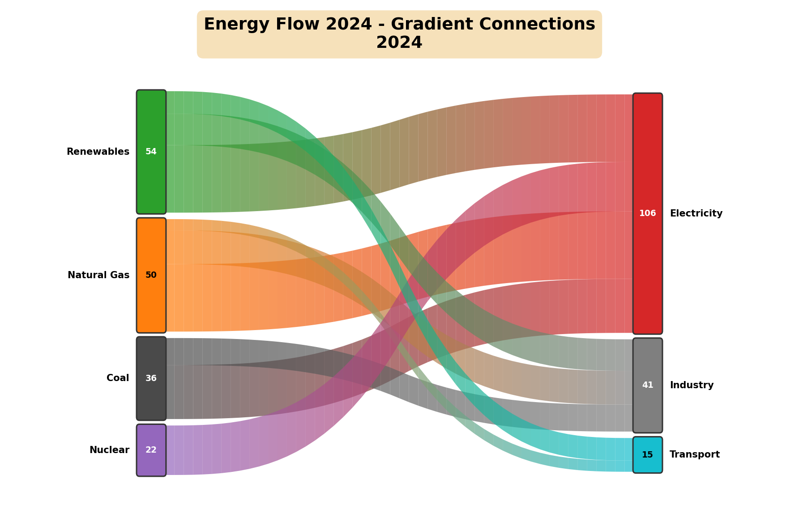
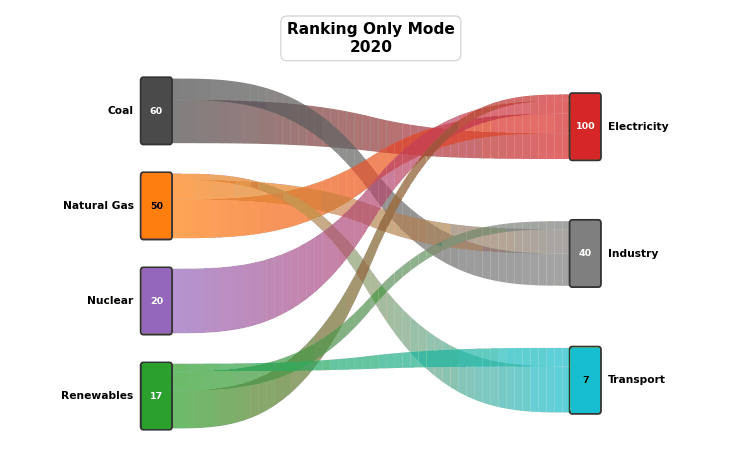
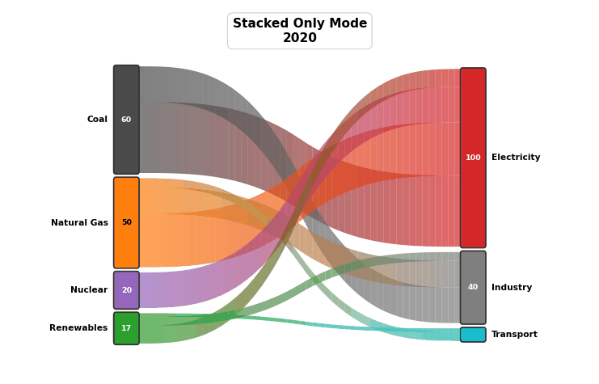
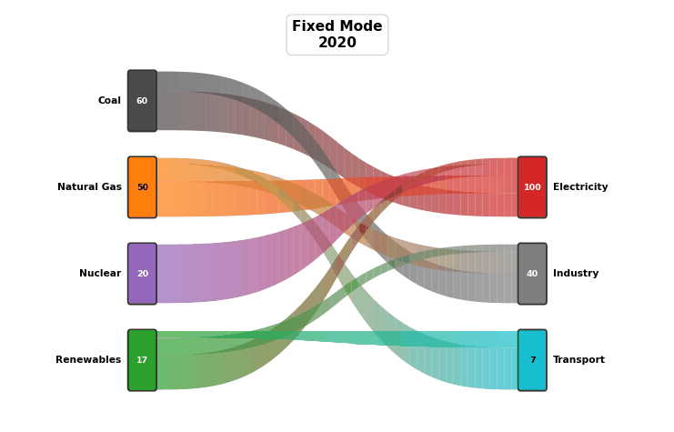
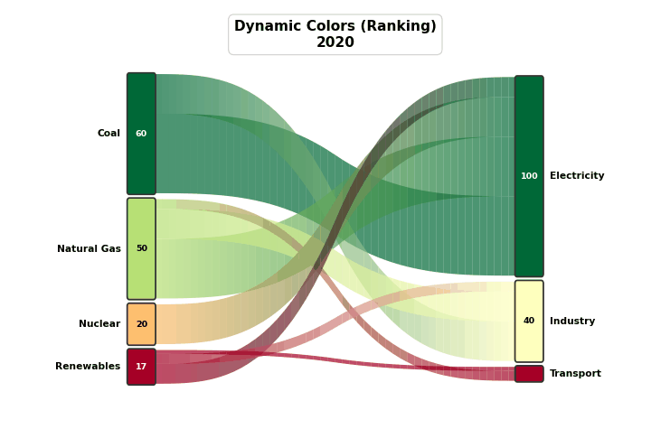

# Animated Sankey Flow

A Python library for creating **Sankey diagrams with real color gradients** - the only library that renders true gradient connections between nodes.


---

## The Gradient Difference

**No popular visualization library supports gradient colors on Sankey connections.** This library is unique in rendering **true color gradients** that smoothly transition from source node color to target node color.



| Library | Sankey Support | Gradient Connections |
|---------|----------------|---------------------|
| Plotly | Yes | No (solid colors only) |
| Matplotlib | No native support | - |
| Seaborn | No | - |
| Holoviews | Yes | No (solid colors only) |
| **This library** | **Yes** | **Yes - true gradients!** |

Each connection is rendered with **50 color segments** by default, creating smooth visual transitions that make data flows intuitive and beautiful. The number of segments is configurable via the `n_segments` parameter.

---

## Features

- **True gradient connections** - colors flow from source to target (50 segments per link)
- **Animated videos** - bar-chart-race style with smooth transitions
- **Static images** - export single-frame Sankey diagrams as PNG/PDF/SVG
- **Multiple animation modes** - ranking, stacked, or both
- **Dynamic node colors** - nodes change color based on ranking/value over time
- **Multiple layers** - support for 2, 3, 4 or more layers
- **10 color palettes** - Rainbow, Viridis, Plasma, and more
- **Parallel rendering** - ~2x faster with multiprocessing
- **High quality** - FancyBboxPatch with rounded corners

---

## Installation

```bash
git clone https://github.com/FG-SC/animated-sankey-flow.git
cd animated-sankey-flow
pip install -r requirements.txt
```

### Dependencies

```
pandas>=2.0.0
numpy>=1.24.0
matplotlib>=3.7.0
```

### FFmpeg (only needed for video export)

- **Windows**: `choco install ffmpeg` or download from https://ffmpeg.org/
- **Linux**: `sudo apt install ffmpeg`
- **macOS**: `brew install ffmpeg`

---

## Quick Start

### Static Sankey Diagram

Create a single-frame Sankey with gradient connections:

```python
import pandas as pd
from sankey_race_multi_layers_parallel import SankeyRaceMultiLayerParallel

# Energy flow data
df = pd.DataFrame([
    {"year": 2024, "source": "Coal", "target": "Electricity", "value": 24},
    {"year": 2024, "source": "Coal", "target": "Industry", "value": 12},
    {"year": 2024, "source": "Natural Gas", "target": "Electricity", "value": 30},
    {"year": 2024, "source": "Natural Gas", "target": "Industry", "value": 15},
    {"year": 2024, "source": "Nuclear", "target": "Electricity", "value": 22},
    {"year": 2024, "source": "Renewables", "target": "Electricity", "value": 30},
    {"year": 2024, "source": "Renewables", "target": "Industry", "value": 14},
    {"year": 2024, "source": "Renewables", "target": "Transport", "value": 10},
])

# Define layers and colors
layers = [
    ["Coal", "Natural Gas", "Nuclear", "Renewables"],
    ["Electricity", "Industry", "Transport"]
]

colors = {
    "Coal": "#4A4A4A",
    "Natural Gas": "#FF7F0E",
    "Nuclear": "#9467BD",
    "Renewables": "#2CA02C",
    "Electricity": "#D62728",
    "Industry": "#7F7F7F",
    "Transport": "#17BECF",
}

# Create Sankey
sankey = SankeyRaceMultiLayerParallel.from_dataframe(
    df=df,
    layers=layers,
    time_col="year",
    source_col="source",
    target_col="target",
    value_col="value",
    node_colors=colors,
)

# Export as static image
sankey.save_frame(
    output_path="energy_flow.png",
    frame_index=0,
    title="Energy Flow 2024",
    figsize=(12, 8),
    dpi=150,
)
```

### Animated Sankey Diagram

Add multiple time periods to create animations:

```python
# Data with multiple years (2020-2030)
df = pd.DataFrame([
    # 2020: High fossil, low renewable
    {"year": 2020, "source": "Coal", "target": "Electricity", "value": 40},
    {"year": 2020, "source": "Renewables", "target": "Electricity", "value": 10},
    # ... more rows ...
    # 2030: Low fossil, high renewable
    {"year": 2030, "source": "Coal", "target": "Electricity", "value": 5},
    {"year": 2030, "source": "Renewables", "target": "Electricity", "value": 90},
])

sankey = SankeyRaceMultiLayerParallel.from_dataframe(
    df=df,
    layers=layers,
    time_col="year",
    source_col="source",
    target_col="target",
    value_col="value",
    node_colors=colors,
)

# Export as animated video
sankey.animate(
    output_path="energy_transition.mp4",
    title="Energy Transition 2020-2030",
    fps=24,
    duration_seconds=10.0,
    ranking_mode=True,
    stacked_mode=True,
)
```

---

## Animation Modes

The library supports four animation modes controlled by `ranking_mode` and `stacked_mode` parameters:

### Stacked + Ranking (Default)

Nodes reorder by value AND resize proportionally. Best for showing both relative size and ranking changes.

```python
sankey.animate(
    output_path="animation.mp4",
    ranking_mode=True,   # Nodes reorder by value
    stacked_mode=True,   # Node heights proportional to value
)
```


---

### Ranking Only

Nodes reorder by value but maintain uniform height. Best for focusing on ranking changes.

```python
sankey.animate(
    output_path="animation.mp4",
    ranking_mode=True,   # Nodes reorder by value
    stacked_mode=False,  # Uniform node heights
)
```



---

### Stacked Only

Fixed node order, heights vary by value. Best for tracking individual node changes over time.

```python
sankey.animate(
    output_path="animation.mp4",
    ranking_mode=False,  # Fixed node order
    stacked_mode=True,   # Node heights proportional to value
)
```



---

### Fixed

Fixed node order AND uniform heights. Only the links animate (changing thickness based on flow values). Best for stable comparisons where you want to focus on flow changes.

```python
sankey.animate(
    output_path="animation.mp4",
    ranking_mode=False,  # Fixed node order
    stacked_mode=False,  # Uniform node heights
)
```



---

## Dynamic Node Colors

Nodes can change color dynamically based on their ranking or value. This creates visually striking animations where rising nodes turn green and falling nodes turn red.

```python
sankey.animate(
    output_path="dynamic_colors.mp4",
    dynamic_color_mode="ranking",  # Color by rank
    dynamic_colormap="RdYlGn",     # Red-Yellow-Green
)
```



### Available Color Modes

| Mode | Parameter | Description |
|------|-----------|-------------|
| **Static** | `"static"` | Fixed colors (default) |
| **Ranking** | `"ranking"` | Color by rank within layer (1st=green, last=red) |
| **Value** | `"value"` | Color by value normalized within each layer |
| **Global Value** | `"global_value"` | Color by value normalized across all frames |
| **Percentile** | `"percentile"` | Color by percentile within layer |

### Recommended Colormaps

| Colormap | Best For | Description |
|----------|----------|-------------|
| `"RdYlGn"` | Ranking | Red (bad) -> Yellow -> Green (good) |
| `"viridis"` | Sequential | Perceptually uniform, colorblind-friendly |
| `"coolwarm"` | Diverging | Blue (low) -> White -> Red (high) |
| `"plasma"` | Sequential | Purple -> Orange -> Yellow |
| `"Blues"` | Positive only | Light blue -> Dark blue |

---

## API Reference

### `SankeyRaceMultiLayerParallel.from_dataframe()`

Create a Sankey object from a pandas DataFrame.

| Parameter | Type | Required | Description |
|-----------|------|----------|-------------|
| `df` | DataFrame | Yes | Flow data with time, source, target, value columns |
| `layers` | List[List[str]] | Yes | Node layers - each inner list is a layer |
| `time_col` | str | Yes | Column name for time/frame |
| `source_col` | str | Yes | Column name for source node |
| `target_col` | str | Yes | Column name for target node |
| `value_col` | str | Yes | Column name for flow value |
| `node_colors` | Dict[str, str] | No | Custom hex colors per node |

**Important:** Node names must be unique across all layers. If the same entity appears in multiple layers, use suffixes:

```python
# WRONG - will cause bugs:
layer1 = ["China", "USA"]
layer2 = ["China", "USA"]  # Name conflict!

# CORRECT:
layer1 = ["China (export)", "USA (export)"]
layer2 = ["China (import)", "USA (import)"]
```

---

### `save_frame()` - Static Image Export

Export a single frame as a static image.

| Parameter | Type | Default | Description |
|-----------|------|---------|-------------|
| `output_path` | str | Required | Output file path (.png, .pdf, .svg) |
| `frame_index` | int | 0 | Which frame to export (0-indexed) |
| `title` | str | None | Title displayed on the image |
| `figsize` | tuple | (16, 10) | Figure size in inches (width, height) |
| `dpi` | int | 150 | Image resolution (dots per inch) |
| `node_width` | float | 0.5 | Width of node rectangles |
| `font_size` | int | 10 | Font size for labels |
| `bar_height_ratio` | float | 0.85 | Ratio of usable height for bars |
| `ranking_mode` | bool | True | Sort nodes by value within each layer |
| `stacked_mode` | bool | True | Node heights proportional to value |
| `n_segments` | int | 50 | Number of gradient segments per link |

```python
sankey.save_frame(
    output_path="output.png",
    frame_index=0,
    title="Energy Flow 2024",
    figsize=(12, 8),
    dpi=150,
    n_segments=50,  # Smooth gradient with 50 color segments
)
```

---

### `animate()` - Video Export

Export animation as video file.

| Parameter | Type | Default | Description |
|-----------|------|---------|-------------|
| `output_path` | str | "sankey.mp4" | Output file path (.mp4, .avi, .mov) |
| `title` | str | None | Title displayed on each frame |
| `fps` | int | 30 | Frames per second |
| `duration_seconds` | float | 10.0 | Total animation duration |
| `quality` | str | "medium" | Video quality: "low", "medium", "high" |
| `figsize` | tuple | (18, 10) | Figure size in inches |
| `node_width` | float | 0.5 | Width of node rectangles |
| `font_size` | int | 10 | Font size for labels |
| `bar_height_ratio` | float | 0.85 | Ratio of usable height for bars |
| `n_workers` | int | cpu_count | Number of parallel workers for rendering |
| `n_segments` | int | 50 | Number of gradient segments per link |
| `ranking_mode` | bool | True | Sort nodes by value (reorder on value change) |
| `stacked_mode` | bool | True | Node heights proportional to value (False = uniform heights) |
| `dynamic_color_mode` | str | "static" | Dynamic color mode (see table above) |
| `dynamic_colormap` | str | "RdYlGn" | Matplotlib colormap for dynamic colors |

**Quality Settings:**

| Quality | DPI | Bitrate | Best For |
|---------|-----|---------|----------|
| `"low"` | 72 | 1500k | Quick previews |
| `"medium"` | 120 | 3000k | General use |
| `"high"` | 200 | 8000k | Presentations, publications |

```python
sankey.animate(
    output_path="animation.mp4",
    title="Energy Transition",
    fps=24,
    duration_seconds=10.0,
    quality="high",
    n_segments=50,        # 50 gradient segments per link
    ranking_mode=True,    # Nodes reorder by value
    stacked_mode=True,    # Node heights vary by value
    dynamic_color_mode="ranking",
    dynamic_colormap="RdYlGn",
)
```

---

## Color Palettes

The library supports **three ways** to specify colors with continuous interpolation:

### 1. Built-in Palettes (ColorPalette enum)

```python
from sankey_race_multi_layers_parallel import ColorPalette, get_palette_colors

# Get 5 colors from Viridis palette (continuous interpolation)
colors = get_palette_colors(ColorPalette.VIRIDIS, n_colors=5)
# Returns: ['#440154', '#3b528b', '#21918c', '#5ec962', '#fde725']
```

| Palette | Matplotlib Colormap | Description |
|---------|---------------------|-------------|
| `RAINBOW` | `rainbow` | Full spectrum: violet -> blue -> green -> yellow -> red |
| `VIRIDIS` | `viridis` | Perceptually uniform, colorblind-friendly |
| `PLASMA` | `plasma` | Purple -> Pink -> Orange -> Yellow |
| `INFERNO` | `inferno` | Black -> Purple -> Red -> Orange -> Yellow |
| `PASTEL` | `Pastel1` | Soft, muted categorical colors |
| `DARK` | `Dark2` | Deep, rich categorical tones |
| `EARTH` | `YlOrBr` | Yellow -> Orange -> Brown (sequential) |
| `OCEAN` | `Blues` | Light blue -> Dark blue (sequential) |
| `SUNSET` | `Oranges` | Light orange -> Dark orange (sequential) |
| `NEON` | `Set1` | Vibrant, high-contrast categorical colors |

### 2. Any Matplotlib Colormap (string)

Use any of the 150+ matplotlib colormaps by name:

```python
# Sequential colormaps
colors = get_palette_colors("Blues", n_colors=5)
colors = get_palette_colors("YlOrRd", n_colors=8)

# Diverging colormaps
colors = get_palette_colors("RdYlGn", n_colors=10)  # Great for rankings
colors = get_palette_colors("coolwarm", n_colors=7)

# Qualitative colormaps
colors = get_palette_colors("Set2", n_colors=6)
colors = get_palette_colors("tab10", n_colors=10)
```

### 3. Custom Discrete Palette (list of hex colors)

Define your own colors - they will be interpolated smoothly:

```python
# Custom Red -> Yellow -> Green palette
custom_palette = ["#FF0000", "#FFFF00", "#00FF00"]
colors = get_palette_colors(custom_palette, n_colors=10)
# Returns 10 colors smoothly interpolated through red, yellow, and green

# Company brand colors
brand_colors = ["#1a1a2e", "#16213e", "#e94560"]
colors = get_palette_colors(brand_colors, n_colors=6)

# Use custom palette for dynamic colors
sankey.animate(
    dynamic_color_mode="ranking",
    dynamic_colormap=["#d32f2f", "#ffc107", "#388e3c"],  # Red-Yellow-Green
)
```

### Additional Options

```python
# Reverse any palette
colors = get_palette_colors(ColorPalette.OCEAN, n_colors=8, reverse=True)

# Use palettes for dynamic node colors
sankey.animate(
    dynamic_color_mode="ranking",
    dynamic_colormap=ColorPalette.VIRIDIS,  # Using enum
)

sankey.animate(
    dynamic_color_mode="value",
    dynamic_colormap="coolwarm",  # Using matplotlib name
)
```

---

## How Gradients Work

The gradient effect is achieved by dividing each link into multiple color segments. Each segment smoothly transitions from the source node color to the target node color using **cubic Bezier curves** for the path shape.

### Gradient Segments

| `n_segments` | Quality | Performance |
|--------------|---------|-------------|
| 10-20 | Visible color bands | Fast |
| **50** (default) | Smooth gradient | Balanced |
| 100+ | Ultra-smooth | Slower |

The gradient colors are computed using linear interpolation in RGB color space:

```
segment_color = source_color + t × (target_color - source_color)
```

where `t` ranges from 0 (source) to 1 (target).

### Link Shape

Links follow a **cubic Bezier curve** for smooth S-shaped transitions:

```python
# Bezier easing function (cubic ease-in-out)
factor = 4 * t³           # for t < 0.5
factor = 1 - (-2t + 2)³/2 # for t >= 0.5
```

This creates natural-looking flow curves that are visually pleasing.

---

## Understanding Sankey Diagrams

### Conservative Flows

In most Sankey diagrams, **flow is conserved**: sum of inputs equals sum of outputs.

```
Energy Sources (100 units) -> Consumption Sectors (100 units)
```

### Non-Conservative Flows

Some diagrams show flows where quantity changes at certain nodes:

```
Revenue ($100) -> Net Income ($30) + Costs ($70)
```

Both types are supported by this library.

---

## Performance

Parallel rendering significantly improves performance:

| Configuration | Time (240 frames) |
|---------------|-------------------|
| Serial | ~70s |
| Parallel (4 workers) | ~32s (**2.2x faster**) |

---

## Project Structure

```
animated-sankey-flow/
├── sankey_race_multi_layers_parallel.py  # Main module
├── assets/
│   ├── gifs/                             # Animation GIFs for documentation
│   │   ├── mode_stacked_ranking.gif
│   │   ├── mode_ranking.gif
│   │   ├── mode_stacked.gif
│   │   ├── mode_fixed.gif
│   │   └── dynamic_colors.gif
│   ├── images/                           # Static images
│   │   └── gradient_example.png
│   └── videos/                           # Example video outputs
├── examples/
│   ├── us_energy_flow.py                 # Conservative flow example
│   └── company_financials.py             # Non-conservative example
├── create_comprehensive_docs.py          # Documentation asset generator
├── poc_dynamic_node_colors.py            # Dynamic colors example
├── requirements.txt
├── README.md
└── LICENSE
```

---

## Troubleshooting

**FFmpeg not found**
Install FFmpeg for video export. The library works for static images without FFmpeg.

**Windows multiprocessing error**
Add `mp.freeze_support()` in your main script:
```python
if __name__ == '__main__':
    import multiprocessing as mp
    mp.freeze_support()
    main()
```

**Nodes appearing in wrong positions**
Ensure node names are unique across all layers.

**Memory errors with large animations**
Reduce `figsize`, `dpi`, or number of frames. Use `n_workers=2` for lower memory usage.

---

## License

MIT License - see [LICENSE](LICENSE) for details.
